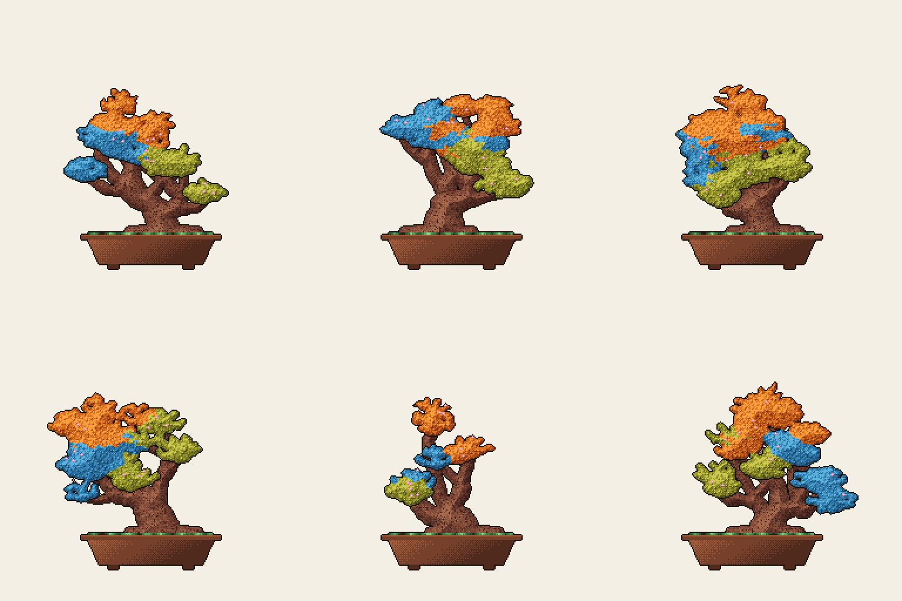
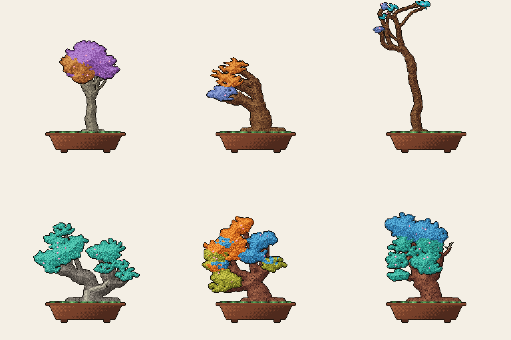
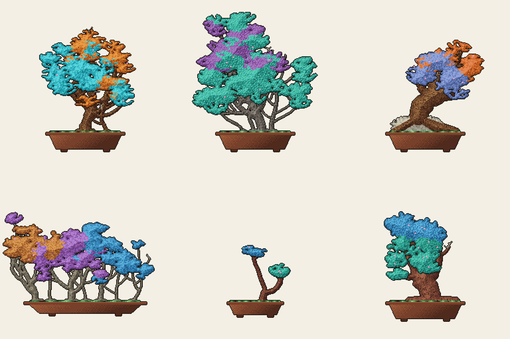
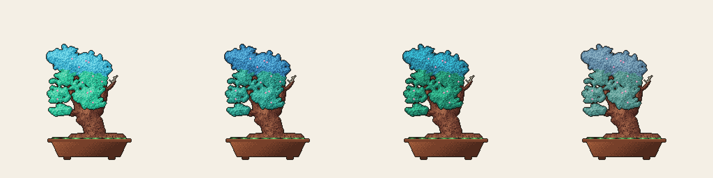
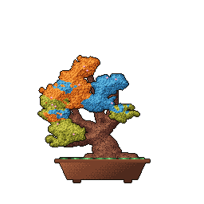
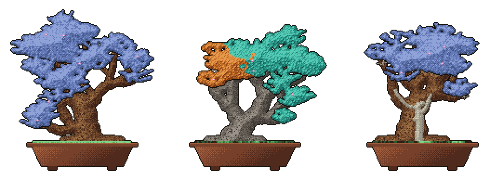
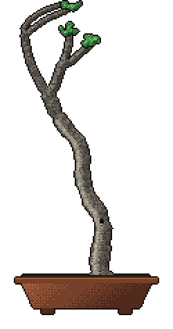

I shipped a small side project this week and I like it more than anything I built this year. It is called [git-bonsai](https://github.com/egorthinks/git-bonsai) and it does exactly one thing: it grows a pixel-art bonsai tree out of your GitHub history.


*This is my tree growing from seed to today. Every account grows exactly one tree.*

Every account gets exactly one tree. Your username is the seed, your history is the shape, so nobody else can ever grow yours. The older your account and the richer your history, the bigger and denser your bonsai. It keeps growing as you keep committing.

## Why a bonsai?

Bonsai is one of the oldest living art forms. It started in Han-dynasty China as *penjing*, "tray scenery", miniature landscapes of trees and rock, then came to Japan around the Kamakura period together with Zen Buddhism, where it was distilled into the art of a single tree in a single pot. A bonsai is never finished. It is a decades-long collaboration between the tree and its keeper, shaped season by season. A crooked trunk, a dead branch, a scar: these are not flaws, they are biography.

And that is exactly what a commit history is. Ten years of an account is not a green calendar heatmap, it is a biography with growth spurts, obsessions, long silences and comebacks. git-bonsai just makes the biography visible: your years become growth rings, your streaks bloom, your burnout gaps leave honest deadwood. You don't draw this tree, you live it.

## How the tree reads your history

Everything is derived, nothing is chosen. A few of the rules:

- **Account age** sets the trunk: height, thickness, branching depth. A young account grows a slim sapling, a decade grows a massive base. It literally cannot be rushed.
- **Total contributions** fill the crown. More commits means denser foliage. Private contributions count too if you enable them on your profile.
- **Streaks bloom.** Each milestone (7, 30, 100, 365 days) adds sakura blossoms, and a live streak of 7+ keeps the tree in bloom.
- **Gaps leave deadwood.** Every silence longer than 60 days turns a branch into gray *jin*. A year away carves a *shari* strip down the trunk. Coming back after two or more years leaves an *uro* hollow. Worn with honor.
- **Your languages paint the crown.** The top language of each of three eras of your account colors the canopy, past at the bottom, present on top. Switch stacks and the tree will show it.
- **Your rhythm picks the style.** Metronome consistency grows a *hokidachi* broom, commit storms after long silences grow a windswept *fukinagashi*, an old minimalist account grows a *bunjin* literati.

Here is what that looks like in practice. Same stats, six different souls, because the seed (the username) decides the tree's character:


*Identical metrics, six different usernames.*

And different histories grow different trees entirely. Style and species are earned, not chosen:


*Left to right: a broom, a windswept, a literati, a sumo trunk with deadwood scars from one long disappearance, a three-era cherry (JS to TS to Astro), and a slanted veteran.*

Some accounts don't even grow one trunk. Two flagship repos of similar weight grow *sokan* twin trunks, several equal flagships grow a *kabudachi* clump, one repo that towers over everything puts the tree on a rock (*sekijoju*), and an organization grows a whole *yose-ue* forest, one small tree per era of its repos. Even the pot is a growth reward: young accounts start in a small *shohin* pot and veterans earn the big *dai* tray.


*Twin trunks, a clump, root-over-rock, a forest. All earned from the shape of the history.*

My favorite detail: the tree lives with the calendar. Leaves flush light in spring, deepen in autumn and frost over in winter, while your languages' hues stay recognizable all year (only true greens turn amber, a TypeScript-blue crown stays TypeScript-blue):


*One tree, four seasons. Re-grow daily and it follows the real calendar.*


*A three-era sakura in the wind. The loop is seamless and, like everything else, deterministic.*

## The Hall of Fame

If the tree is a biography, the obvious question is: what did the greats grow? So the repo now has a [Bonsai Hall of Fame](https://github.com/egorthinks/git-bonsai/blob/main/HALL_OF_FAME.md), trees grown from the public history of people whose work shaped how we all write software. Same rules as everyone, nothing drawn by hand: every trunk, scar and blossom is earned, and the gallery is regenerated from cached metrics so it stays reproducible bit for bit.


*Left to right: Linus Torvalds (15 years, a slanting sumo pine), Guido van Rossum (14 years, a maple), Salvatore Sanfilippo of Redis (17 years, formal upright with a shari scar down the trunk).*

There are sixteen keepers in there so far: Dan Abramov's windswept sakura, DHH's twin-trunk maple with both *shari* and *uro* scars, Fabien Potencier's tree fed by 264,440 contributions. And of course, Claude Code:


*The @claude account. Its real work hides in Co-Authored-By trailers, so the calendar shows a bare literati with honorable scars.*

## How to grow yours

Add `.github/workflows/bonsai.yml` to your profile repo (the one named after your username):

```yaml
name: bonsai
on:
  schedule:
    - cron: '0 3 * * *'   # re-grow daily
  workflow_dispatch:
permissions:
  contents: write
jobs:
  grow:
    runs-on: ubuntu-latest
    steps:
      - uses: actions/checkout@v4
      - uses: egorthinks/git-bonsai@v1
```

Then embed the result in your README:

```html

```

The action writes four files: `bonsai.svg`, `bonsai.png`, `bonsai.gif` (wind loop) and `bonsai-growth.gif` (the seed-to-tree timelapse). The images are auto-cropped to your tree's real size, so a young bonsai ships in a small box with no empty sky above it, and the canvas grows as the tree grows. Every run also drops a shareable summary with a one-click "Share on X" link into the workflow's job summary page, and if you are proud of your tree there is a ["grown with git-bonsai" badge](https://github.com/egorthinks/git-bonsai#install-3-lines-of-yaml) for your README.

If you just want to peek at your tree without touching CI:

```bash
npx git-bonsai --user yourname --token $GITHUB_TOKEN   # real data
npx git-bonsai --synth yourname                        # offline demo
```

## Under the hood, briefly

No pre-drawn trees, no runtime dependencies, 100% procedural. The username goes through FNV-1a into a seeded PRNG, the metrics become a genotype, a stochastic L-system grows the trunk and branches, space colonization grows the twigs, branch thickness follows the pipe model, and the whole thing is rasterized onto a 256x256 indexed buffer with a fixed 32-color palette, shaded with an SDF and Bayer dithering, then encoded by a hand-rolled GIF89a encoder. Determinism is a hard guarantee: the same username with the same metrics produces bit-identical bytes on every run. There is no `Math.random()` anywhere in the codebase.

## Show me yours

The whole point of a unique tree is showing it off. If you grow one, post it with **#gitbonsai** or drop a link in the [repo discussions](https://github.com/egorthinks/git-bonsai/discussions). I genuinely want to see what a decade of someone else's commits looks like as a living thing. And if your tree comes out with a *shari* scar down the trunk, wear it proudly. It just means you came back.

**PS if you liked this, subscribe to the newsletter below. I write about code, cognition and small strange projects like this one. Thanks!**

## Sources

- [git-bonsai on GitHub: the action, the source code and the design notes.](https://github.com/egorthinks/git-bonsai)
- [The Bonsai Hall of Fame: the trees of Linus, Guido and other keepers of legendary histories.](https://github.com/egorthinks/git-bonsai/blob/main/HALL_OF_FAME.md)
- [My own bonsai, growing live in my profile repo.](https://github.com/egorthinks/egorthinks)
