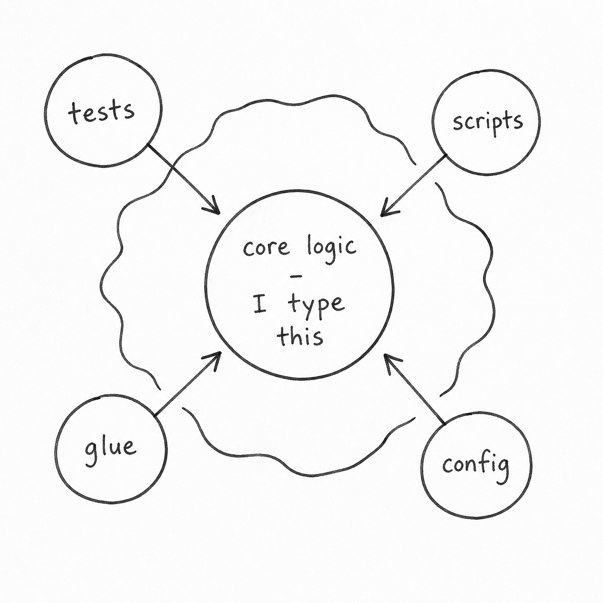

> When MIT researchers put EEG caps on people writing essays with ChatGPT, **83%** of the AI group could not quote a single sentence from the essay they had just finished. The number stayed abstract to me until I opened my own repo and did not recognize the code on screen.

## The forty-second pause

Last Tuesday I opened my project repo to fix a small bug in the scoring code. The bug was nothing, a wrong threshold. I knew which file, opened it, and then I just sat there for maybe forty seconds.

The function was 28 lines. My name was on the commit. The code was fine. *I had no idea I had written it.*

I scrolled up to look at git blame and there I was, `Egor Fedorov, 6 days ago`. I scrolled through the rest of the file and the same thing kept happening. I recognized the structure (because I had asked for the structure), but the specific lines were a blank. Like reading a translation of a book I wrote in another language.

For a while I told myself this was just me. Bad sleep, too many projects, getting older. The usual excuses for when your brain stops doing something it used to do without effort. Then I read the MIT paper.

## What the MIT study found

In June 2025, a team led by Nataliya Kosmyna at the MIT Media Lab put EEG caps on 54 people and had them write essays in three sessions. One group wrote unaided, one had Google, the third was given ChatGPT and told to use it. The headline behavioral result is a single number: **83% of the ChatGPT group could not produce any quote** from the essay they had just written, minutes earlier. Of the 17% who managed a quote, none of them were accurate to the original text. In the unaided group, that quote-failure rate was around 11%.

The EEG side of the paper showed the matching picture in the brain. The unaided group exhibited the strongest, most distributed neural networks during writing. The Search Engine group sat in the middle. The ChatGPT group showed the weakest connectivity, particularly in the alpha and beta bands associated with internal attention. The paper is [an arXiv preprint](https://arxiv.org/abs/2506.08872), not yet peer-reviewed, and there are published critiques of the sample size and the EEG methodology. I take those seriously. But the 83% behavioral number is the kind of result that does not need fancy statistics to land. They typed the words. They could not say them back.

This was what was happening to me with my own code. Not metaphorically. Specifically: the part of my brain that should hold what I just made was not doing it. I had been calling this a personal weakness. It is a pattern, and there is now imaging that matches the feeling.

## Why accepting a diff is not the same as writing

Here is what I think is going on, mechanically. When I type code myself, my hands are part of the encoding. My fingers know `useEffect` before my conscious mind does. There is a small piece of motor memory that fires when I see code I wrote. A faint *yes, I made that*. When I review AI-generated code and accept it, that motor piece never happens. The code goes in through my eyes and out through a `y/n` decision and that is the whole loop.

What I am describing (you encode more strongly when you produce something than when you only recognize it) is sometimes called the *generation effect*. [Slamecka and Graf showed it on word pairs in 1978](https://doi.org/10.1037/0278-7393.4.6.592); it has been replicated many times since, on other materials. None of it is about code. But the shape of it lines up with what I feel in my repo, and with what the MIT EEG caps were picking up in a different task.

*Same code, two different traces left in my head.*

## Hand-typed vs agent-generated, in the same file

So I started paying attention to which files I could navigate and which I could not. The ones I can find my way around without git blame are the ones I typed by hand. There is a small scoring helper I wrote myself in one of those moods where Claude Code kept getting an off-by-one wrong and I just took the keyboard back; I can still see the indentation in my head a month later. Forty lines down in the same file is a function the agent generated in one shot, which I have read maybe five times this week, and which is still a stranger.

## The taxi driver and the GPS

There is a parallel here that should make this less surprising, and it bothers me that it took me this long to see it. In 2000, [Maguire's group at University College London](https://doi.org/10.1073/pnas.070039597) scanned the brains of licensed London taxi drivers, who memorize about 26,000 streets to get certified. Their posterior hippocampus (the part of the brain that builds spatial maps) was measurably larger than matched controls, and grew with years on the job. Later research on heavy GPS users has found, roughly, the inverse pattern: when you outsource the map to a device, the map-making system goes quiet. The story on the GPS side is less clean than the taxi-driver one (different groups, different methods, contested effect sizes), but the direction is consistent. Use the equipment, the equipment stays in shape. Hand the work to a tool, the equipment stops bothering.

Everyone reading this has felt the GPS version. You drive to the same friend's house six Saturdays in a row with Waze on, and you still need Waze on the seventh, because your brain never bothered to build the map. The MIT result is the same mechanism applied to writing. What I am describing in my own repo is the same mechanism applied to code.

## The habit that forms around not-reading

What worries me is not the forgetting itself but the habit forming around it. Every block I accept without really reading is practice at not-reading. A few hundred such reps and the impulse to read carefully starts to weaken. I can still do it if I make myself. What fades is the wanting to. The cost shows up later, in a debugging session that takes twice as long because I have to learn my own code from scratch.

## Learning less while finishing faster (Shen & Tamkin)

In January 2026, [Judy Hanwen Shen and Alex Tamkin published a study](https://arxiv.org/abs/2601.20245) that came at this from a different angle. They had developers learn a new asynchronous Python library (Trio) either with AI help or without, then tested them on conceptual understanding, code reading, and debugging. The AI group scored about **17% lower** on the comprehension quiz. They finished the work, sometimes faster, but understood it less. Tamkin is at Anthropic, which I noticed and which probably matters less than it sounds.

The part of that paper that stuck with me is the part most of the coverage skipped over. Shen and Tamkin identified six different patterns of how people used the AI, and three of them preserved learning even with assistance. The pattern that did not preserve learning was the obvious one. Copy the output, accept, move on. The patterns that did preserve learning involved staying engaged with what the model produced instead of just receiving it. Which is roughly the rule I am trying to write for myself, except they had data and I had a forty-second pause.

## The perception gap (METR)

There is one more study worth knowing about here, and I want to include it with the right caveats. In July 2025, [METR ran a randomized trial](https://arxiv.org/abs/2507.09089) on 16 experienced open-source developers, 246 tasks, in repositories where each developer had on average five years of prior experience. The headline result that everyone repeated: developers using AI tools (Cursor with Claude 3.5/3.7 Sonnet) took **19% longer** to complete tasks than developers without. The developers themselves had forecast a 24% speedup, and reported feeling **20% faster** after the study. METR have since walked back the 19% number; in a February 2026 update they acknowledged selection effects and methodology issues, and now say they cannot confidently estimate the direction of the speed effect at all.

I do not have a stake in the methodological argument. What I cannot stop thinking about is the perception gap. Whatever the true effect on speed turns out to be, the participants in the original study felt 20% faster while being measured 19% slower, and they had no idea. That gap is hard to argue with, and it is the same shape as the MIT finding. The participants did not feel less engaged. They felt fine. The offloading is invisible from the inside.

## The line I am drawing (for now)

I am not going to stop using Claude Code. I tried writing everything by hand for a week as an experiment and got about a fifth as much done. The honest position is that AI coding tools are a permanent part of how I work, and the question I keep returning to is which parts I refuse to delegate.

For now my rough rule, written in pencil so I can erase it next month: anything that touches the core logic of the system I am responsible for, I type with my own hands, even if Claude could do it faster. Anything else (boilerplate, tests, glue code, scripts I will run twice and throw away) I let the agent do.

*The line I am drawing this month. It might move.*

I do not know if this rule will hold. The category "core logic" may dissolve as the tools get better, and then I will need a new line. And I cannot tell yet whether reading my own code like a stranger is a phase I adapt out of, or the first sign of something more permanent.

## Cognitive debt

What I do know is that the forty-second pause at my own function was not nothing. *Cognitive debt* is the phrase the MIT team used for the thing their EEG caps were measuring, and it is the right word for what I felt looking at that file. Debts compound while you feel fine. They show up later, on a day you were not planning to need the principal.

The reason I wrote this down is that I want a way to notice the bill earlier next time. I cannot tell anyone else what to do about this. I do not know yet what to do about it myself. I would rather see the cost clearly than keep pretending the trade is free.

## Sources

- [Kosmyna, N., Hauptmann, E., Yuan, Y. T., Situ, J., Liao, X. H., Beresnitzky, A. V., Braunstein, I., & Maes, P. (2025). Your Brain on ChatGPT: Accumulation of Cognitive Debt when Using an AI Assistant for Essay Writing Task. arXiv:2506.08872.](https://arxiv.org/abs/2506.08872)
- [Slamecka, N. J., & Graf, P. (1978). The generation effect: Delineation of a phenomenon. *Journal of Experimental Psychology: Human Learning and Memory*, 4(6), 592–604.](https://doi.org/10.1037/0278-7393.4.6.592)
- [Maguire, E. A., Gadian, D. G., Johnsrude, I. S., Good, C. D., Ashburner, J., Frackowiak, R. S. J., & Frith, C. D. (2000). Navigation-related structural change in the hippocampi of taxi drivers. *Proceedings of the National Academy of Sciences*, 97(8), 4398–4403.](https://doi.org/10.1073/pnas.070039597)
- [Shen, J. H., & Tamkin, A. (2026). How AI Impacts Skill Formation. arXiv:2601.20245.](https://arxiv.org/abs/2601.20245)
- [Anthropic: How AI assistance affects coding skills.](https://www.anthropic.com/research/AI-assistance-coding-skills)
- [Becker, J., Rush, N., Barnes, B., & Rein, D. (2025). Measuring the Impact of Early-2025 AI on Experienced Open-Source Developer Productivity. arXiv:2507.09089.](https://arxiv.org/abs/2507.09089)
- [METR: Measuring the impact of early-2025 AI on experienced open-source developer productivity.](https://metr.org/blog/2025-07-10-early-2025-ai-experienced-os-dev-study/)
